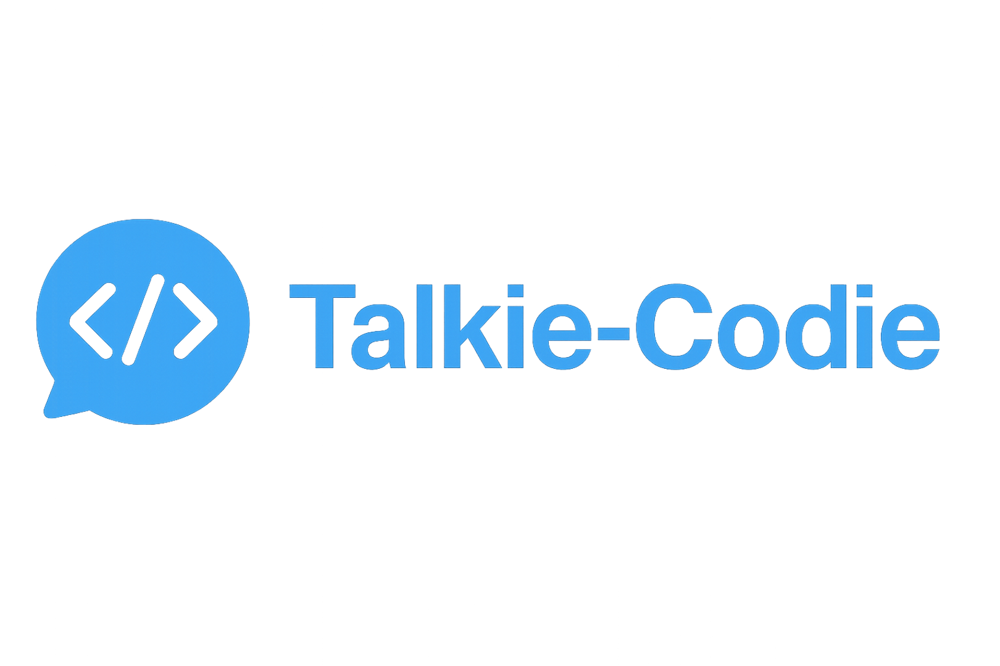

# Talkie-Codie
语音转提示词，赋能你的编程体验

[English](README.md) | [中文](README_CN.md)


一个跨平台桌面应用程序，使用AI驱动的语音识别和语言模型增强，将您的语音转换为优化的提示词。

## 快速开始

### 环境要求
- Python 3.10 或更高版本
- 麦克风访问权限

### 运行应用程序

1. **可选：创建虚拟环境**
   ```bash
   # 使用 conda
   conda create -n talkie-codie python=3.10
   conda activate talkie-codie
   
   # 或使用 venv
   python -m venv talkie-codie
   source talkie-codie/bin/activate  # Windows: talkie-codie\Scripts\activate
   ```

2. **启动图形界面（自动安装依赖）**
   ```bash
   python run_gui.py
   ```

**注意**: 首次启动可能较慢，因为需要下载模型。在GUI设置中配置您的API密钥。

**注意**: 如果没有配置API，应用程序将仅使用Whisper进行音频转文本转换。

### 配置

所有设置都可以通过GUI配置：
- **LLM提供商和API密钥**: OpenAI 或 DeepSeek
- **Whisper设置**: 设备、模型大小、计算类型
- **音频设备**: 选择您的麦克风

### 命令行模式
```bash
python src/main.py
```

## 使用方法

1. **选择输入设备**: 从下拉菜单中选择您的麦克风
2. **开始录音**: 点击录音按钮开始语音捕获
3. **查看结果**: 查看转录文本和AI增强的提示词
4. **复制输出**: 使用复制按钮复制优化的提示词
5. **设置**: 通过设置按钮访问配置选项

### 缓存管理

```bash
# 查看缓存信息
python scripts/clear_cache.py info

# 清理缓存（需要确认）
python scripts/clear_cache.py clear

# 强制清理缓存
python scripts/clear_cache.py clear-force
```

## 依赖项

- **PyQt6**: 现代GUI框架
- **sounddevice**: 音频录制和播放
- **faster-whisper**: 语音转文字转录
- **scipy/numpy**: 科学计算
- **requests**: API调用的HTTP客户端

## 故障排除

### 常见问题

1. **未检测到音频输入**
   - 检查麦克风权限
   - 验证设置中的设备选择
   - 确保麦克风未静音

2. **LLM API错误**
   - 验证API密钥是否正确
   - 检查网络连接
   - 确保有足够的API额度

3. **Whisper模型下载问题**
   - 检查网络连接
   - 验证有足够的磁盘空间
   - 尝试在设置中使用不同的模型大小

---

**注意**: 此应用程序需要活跃的网络连接来进行LLM API调用和初始Whisper模型下载。 